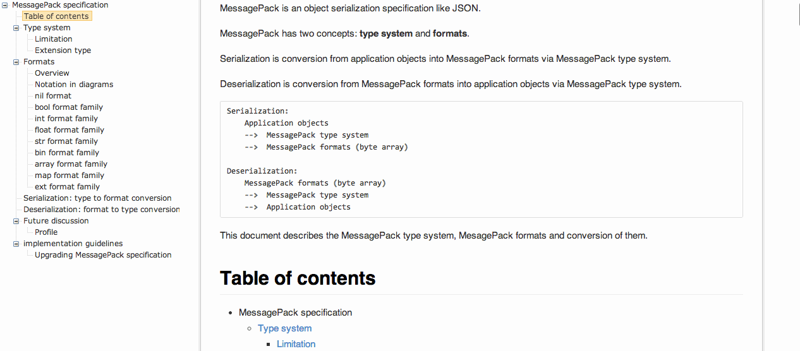

# MessagePack specification 

 MessagePack is an object serialization specification like JSON.
 
 this repo is a [i5ting_ztree_toc](https://github.com/i5ting/i5ting_ztree_toc) examples
 
 
 
 
## 生成本地html文档
 
	 tocmd_local -f spec.md
 
## 改造

如果想更好的i5ting_ztree_toc，肯需要对其配置项做一些简单修改的，具体参见 [i5ting_ztree_toc](https://github.com/i5ting/i5ting_ztree_toc) 文档。
 
### 修改js部分

js修改后如下：

	$(document).ready(function(){
		$('#tree').ztree_toc({
			debug:false,
			is_auto_number:false,
			documment_selector:'.markdown-body',
			ztreeStyle: {
				width:'290px',
				overflow: 'auto',
				position: 'fixed',
				'z-index': 2147483647,
				border: '0px none',
				left: '0px',
				top: '0px'
			}
		});
	});

参数说明：

- `is_auto_number:false`意思是说在生成的roc不显示序号
- `ztreeStyle`设置目的是为了让toc位于左上方
 
### 修改html部分

默认的toc有2个显示item不在可视区域内，所以需要稍微调整一下tree和mardown显示区的宽度

	<body>
	

		

			<ul id="tree" class="ztree" style='width:100%'>
			
			</ul>
		

		

说明

- `
`此处修改宽度
- 同时修改了`ztreeStyle.width = 290px`

## 欢迎fork和反馈

在issue提问或邮件shiren1118@126.com

## License

this gem is released under the [MIT License](http://www.opensource.org/licenses/MIT)
